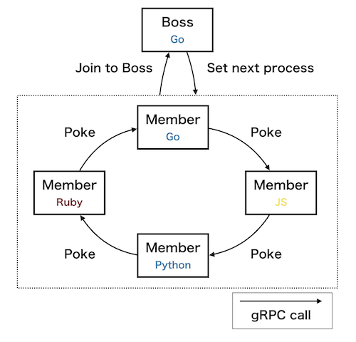

# gRPC guruguru
This is a useless gRPC server/client process model. This project is for my gRPC training.

First, a boss process waits for member processes joining. Once all members joined the boss forms cyclic linked list of members by setting next process to each members.

Each members accept poke messages. When a member receives a poke message, then the member sends a new poke message to its next member process. That means that poke messages loop around the members list infinitely.



Member processes are written by each language. These are based on the same proto file as you can see. Used languages are below:

- Go
- Python
- JavaScript(Node.js)
- Ruby
- ...

## How to try

```console
$ make build # for first
$ make up
```

